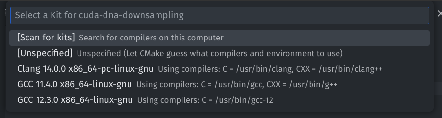

# Contributing

## File structure

```
Foo
 ├── include
 │   └── Foo
 │       ├── Foo.h
 │       └── ...
 ├── src
 │   ├── Foo.cpp
 │   └── ...
 ├── test
 │   └── ...
 └── libs
     ├── A
     │   ├── include
     │   │   └── A
     │   │       ├── A.h
     │   │       └── ...
     │   ├── src
     │   │   ├── A.cpp
     │   │   └── ...
     │   └── test
     │       └── ...
     └── B
         ├── include
         │   └── B
         │       ├── B.h
         │       └── ...
         ├── src
         │   ├── B.cpp
         │   └── ...
         └── test
             └── ...
```

https://github.com/Jamagas/CMake

## Setup
Required software:
- **CUDA 12.4**: nvcc, cuda toolkit
- **gcc/g++** (at least 12.0) – compilation of `.cpp` files on linux, 
- **clang/clang++** (at least 14.0) – LLVM’s frontend for g++ and msvc (it overlays both), clang supports CUDA $\leq$ 12.1, so we are not going to use it for compilation, but [clangd](https://clangd.llvm.org/features) and [clang-tidy](https://clang.llvm.org/extra/clang-tidy/) depend on it,
- [**clangd**](https://clangd.llvm.org/features) (at least 14.0) – LLVM's cpp LSP (Language Server Protocol):
  - runs the clang compiler on your code as you type, the compiler may suggest fixes for many common problems automatically,
  - embeds [clang-tidy](https://clang.llvm.org/extra/clang-tidy/) which provides extra hints about code problems: bug-prone patterns, performance traps, and style issues,
  - provides auto-completion,
- **clang-format** (at least 14.0) – LLVM’s c/cpp code formatter,
- **stdlibc++** (for clang 14.0 we need at least 12.0) – GNU implementation of C++ standard library, there is also LLVM’s libc, but we are going to use stdlibc++
- **cmake** (at least 3.21),
- **cmake-format** (at least 0.6) – allows cmake files formatting,
- **python3** & **pre-commit** – required for the github hooks 

Required vscode extensions:
- **clangd** (author: LLVM) – clangd is a language server, and provides C++ IDE features to editors,
- **clang-format** (author: Xaver Hellauer) – provides clang formatting integration,
- **cmake** (author: twxs) – provides autocompletion, and syntax highliting for cmake,
- **cmake tools** (author: Microsoft) – provides cmake commands for build, run, test etc,
- **cmake-format** (author: cheshirekow) – provides cmake formatting integration.

VSCode configuration:

```json
// Autoformatting
  "editor.formatOnSave": true,

  "[cpp]": {
// Use clang formatter
    "editor.defaultFormatter": "xaver.clang-format"
  },

  "cmake.options.statusBarVisibility": "visible",

// Set clangd as default provider
  "C_Cpp.default.configurationProvider": "clangd",
// Disable Microsoft's intelli sense
  "C_Cpp.intelliSenseEngine": "disabled",

// Find your executables for these programs (which command)
  "clang-format.executable": "/usr/bin/clang-format",
  "clangd.path": "/usr/bin/clangd",
  "cmakeFormat.exePath": "/usr/bin/cmake-format",

  "[cmake]": {
// Use cmake formatter
    "editor.defaultFormatter": "cheshirekow.cmake-format"
  },
```

### VSCode + Linux, how to use:
When the project is opened for the first time vscode will ask you for choosing cmake kit – use the newest gcc. It can be changed later.



Don’t use regular run, when you want to build or run your app use `Ctrl+Shfig+P` and choose CMake Build/Run/Debug.

### Pre-commits

```bash
git commit --no-verify
```