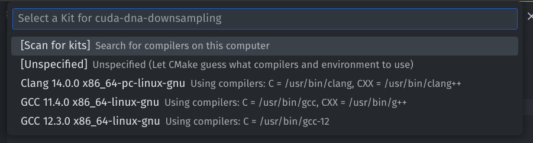

# Contributing
## TODO
- `.cu` files don't see the packages added with CPM (it compiles but clangd shows errors in vscode), it needs to be fixed
## File structure

```
Foo
 ├── include
 │   └── Foo
 │       ├── Foo.h
 │       └── ...
 ├── src
 │   ├── Foo.cpp
 │   └── ...
 ├── test
 │   └── ...
 └── libs
     ├── A
     │   ├── include
     │   │   └── A
     │   │       ├── A.h
     │   │       └── ...
     │   ├── src
     │   │   ├── A.cpp
     │   │   └── ...
     │   └── test
     │       └── ...
     └── B
         ├── include
         │   └── B
         │       ├── B.h
         │       └── ...
         ├── src
         │   ├── B.cpp
         │   └── ...
         └── test
             └── ...
```

https://github.com/Jamagas/CMake

## Project Setup
We are going to use C++17 lanugage standard.
### Compilation
For compilation we are going to use:
- **CUDA ==12.4**: the newest CUDA version,
- **gcc/g++ >=11.0**: 
  - supports C++17,
  - compatible with the newest cuda version (every GCC prior to 7.3 is compatible with CUDA 12.4), 
- **clang/clang++ >=14.0**:
  - supports C++17,
  - clang is a frontend to LLVM c/cpp compiler,
  - supports most of the compilation flags of gcc/g++, and provides more features than gcc/g++, 
  - we will use mainly for clangd LSP, the compilation will be done with gcc,
  - doesn't support CUDA > 12.1, it treats 12.4 like it was 12.1, thats the reason why gcc is used.
- **stdlibc++ >= 12.0**: cpp standard library, on ubuntu it may be installed with `sudo apt install libgcc-12-dev`,
- **cmake >= 3.21**,
- **cmake-format (optional)** allows cmake files formatting.


### Linter
- **clang-format >= 14.0**: responsible for code formatting
- **clang-tidy >= 14.0**: responsible for code analysis, it forces good practices defined in `.clang-tidy`
- **python3 (optional)**: required for lint script that you can invoke `./lint`, it checks if all of the files pass the clang-tidy test.

### Language Server Protocol
**clangd** is a language server protocol that runs the clang/clang++ compiler and clang-tidy on your code as you type. It also provides autocompletion feature.

### VSCode extentions
Required vscode extensions:
- **clangd** (author: LLVM): clangd is a language server, and provides C++ IDE features to editors,
- **clang-format** (author: Xaver Hellauer): provides clang formatting integration,
- **cmake** (author: twxs): provides autocompletion, and syntax highliting for cmake,
- **cmake tools** (author: Microsoft): provides cmake commands for build, run, test etc,
- **cmake-format** (author: cheshirekow): provides cmake formatting integration.

VSCode configuration:

```json
// Autoformatting
  "editor.formatOnSave": true,

  "[cpp]": {
// Use clang formatter
    "editor.defaultFormatter": "xaver.clang-format"
  },

  "cmake.options.statusBarVisibility": "visible",

// Set clangd as default provider
  "C_Cpp.default.configurationProvider": "clangd",
// Disable Microsoft's intelli sense
  "C_Cpp.intelliSenseEngine": "disabled",

// clang-tidy config
  "C_Cpp.codeAnalysis.clangTidy.enabled": true,
  "C_Cpp.codeAnalysis.clangTidy.path": "/usr/bin/clang-tidy",
  "C_Cpp.codeAnalysis.clangTidy.useBuildPath": true,
  "C_Cpp.codeAnalysis.clangTidy.args": [
      "-p ./build/"
  ]

// Find your executables for these programs (which command)
  "clang-format.executable": "/usr/bin/clang-format",
  "clangd.path": "/usr/bin/clangd",
  "cmakeFormat.exePath": "/usr/bin/cmake-format",

  "[cmake]": {
// Use cmake formatter
    "editor.defaultFormatter": "cheshirekow.cmake-format"
  },
```

### Project dependencies
We are depending on 3 libraries:
- [**boost >= 1.74**](https://www.boost.org/): this library provides a huge amount of features that are not part of the STL (e.g. regexes) -- including graph module and some STL alernatives (e.g. boost::optional),
- [**samtools/htslib >= 1.19**](https://github.com/samtools/htslib): C library for accessing common file formats, such as SAM, CRAM and VCF, used for high-throughput sequencing data,
- [**CLI >= 2.4**](https://github.com/CLIUtils/CLI11): command line parser for C++11.

The dependencies that needs to be installed by the developer are:
- boost,
- samtools/htslib: see [INSTALL](https://github.com/samtools/htslib/blob/develop/INSTALL).

#### Ubuntu
```bash
sudo apt install libboost-all-dev 
sudo apt apt install autoconf automake make gcc perl zlib1g-dev libbz2-dev liblzma-dev libcurl4-gnutls-dev libssl-dev

git clone https://github.com/samtools/htslib.git
cd htslib
make 
sudo make install
cd ../
rm -rf ./htslib/
```

### VSCode + Linux, how to use:
When the project is opened for the first time vscode will ask you for choosing cmake kit – use the newest gcc. It can be changed later.



Don’t use regular run (it just calls `gcc`), when you want to build or run your app use `Ctrl+Shift+P` and choose CMake Build/Run/Debug. The CMake Build option will link all libraries and invoke `gcc` with proper params. 
